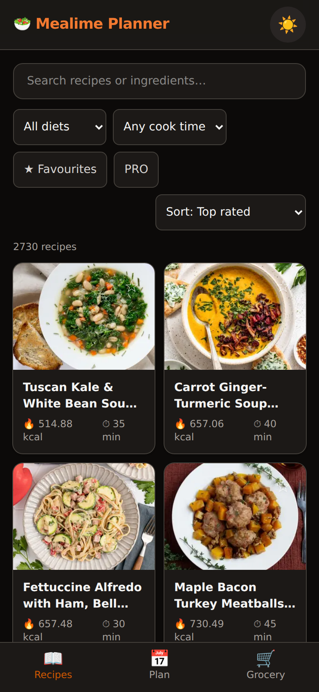

# Mealime Planner

<p align="center">
  
  
  
  
  
</p>
<p align="center">
  
</p>

A mobile-first single-page app for browsing the Mealime recipe catalog,
building a meal plan, and generating a grocery list from it.

Fully offline and fully self-contained: the repo ships the complete recipe
catalog — all 2,730 full recipe documents (`public/data/recipes/`, ~15 MB,
one JSON per variant id) plus the catalog snapshot — **and every recipe
image** (`public/img/recipes/`, one WebP per archived Mealime CDN image).
The app makes **no external requests at runtime**: recipe details are
fetched from the bundled local files, and all imagery (thumbnails,
presentation images, favourites) is served from the local archive via the
naming rule *remote-URL basename with the extension swapped to `.webp`*.
Recipes without an image (or whose local file is missing) fall back to a
neutral placeholder.

## Features

- **Recipes** — browse 2,730 variants in a responsive card grid with search
  (by name or ingredient), category / favourites / cook-time / PRO filters,
  and sorting by rating, popularity, latest, cook time or calories.
  Full-screen detail view with presentation image, macro split, cookware,
  ingredients and instructions, plus a servings stepper that scales
  quantities (per-serving nutrition stays fixed; only totals scale).
- **Plan** — add recipes with per-meal serving counts; totals for kcal, cook
  time and meal count. Persisted to `localStorage`.
- **Grocery** — aggregates ingredient line items across the whole plan:
  quantities are parsed and scaled by each meal's serving factor, grouped by
  singularized ingredient name (`carrot`/`carrots` merge), summed per
  normalized unit (`2 cloves` + `1 clove` → `3 cloves`), and bucketed into
  canonical grocery-store sections via a keyword heuristic (fallback:
  "Other"). Ingredients shared between several planned meals get a
  "N recipes" badge (hover/focus shows which). Free-form items not in any
  recipe can be added ("Extra items") and are included in shares.
  Checkboxes, progress bar and "clear checked" persist to `localStorage`.
- **Cooking mode** — a full-screen, distraction-free step-by-step view
  (`/cooking/:id`) with one step at a time, per-step scaled ingredients,
  progress (Step N / M) and keyboard/swipe navigation.
- **Live room sync** — the plan tab's share sheet can start a *live room*:
  one person creates it, anyone opening `/plan?room=CODE` joins, and every
  change to the plan, custom grocery items and grocery checkmarks
  propagates instantly both ways (last-write-wins per revision). A status
  chip in the header shows Live / Connecting / Offline; the room code is
  kept for the browser session so page reloads re-join automatically. The
  classic one-time `?p=` share link is still available for offline
  sharing.
- **Shopping mode** — a full-screen, big-target checklist of the grocery
  list, optimized for in-store use: one collapsible section per store
  section, large tap rows with big custom checkboxes, checked items fade
  and sink within their section, and a sticky progress bar with an Exit
  button. Entered from the grocery tab's "Start shopping" button.
- **Dark mode** — follows the OS preference on first load; the header
  toggle overrides it and the choice persists.

Favourites are seeded from the data snapshot and can be toggled per recipe.

## Run with Docker Compose (recommended)

`docker-compose.yml` starts two services: **web** (nginx serving the app,
port 8097 on the host) and **relay** (the WebSocket sync service). nginx
proxies `/ws` to the relay, so everything is served from one origin.

```bash
docker compose up -d --build
# open http://localhost:8097
```

Stop with `docker compose down`. The relay keeps room state in memory —
restarting it drops live rooms (plans/checklists live in each browser's
`localStorage` and are never lost).

## Run with plain Docker

No volume is needed — the full offline catalog, images and app bundle are
baked into the image. Running without compose means no live-room sync
(no relay behind `/ws`); everything else works.

```bash
docker build -t mealime-planner .
docker run -d -p 8080:80 mealime-planner
# open http://localhost:8080
```

Build is multi-stage (`node:22-alpine` → `nginx:alpine`) with gzip, an SPA
fallback and cache headers (immutable 1y for `/assets/` and `/img/`, no-cache
for `index.html`).

## Behind Traefik

Expose **only the `web` service** — Traefik routes `Host` traffic to it and
nginx internally proxies `/ws` to the relay. Add these labels to the `web`
service in your compose file:

```yaml
services:
  web:
    build: .
    networks: [traefik, internal]   # internal carries web→relay /ws traffic
    labels:
      - traefik.enable=true
      # Router: match your hostname, terminate TLS
      - traefik.http.routers.mealime.rule=Host(`mealime.example.com`)
      - traefik.http.routers.mealime.entrypoints=websecure
      - traefik.http.routers.mealime.tls.certresolver=le
      # Service: nginx listens on port 80 inside the container
      - traefik.http.services.mealime.loadbalancer.server.port=80
      # Do NOT expose the relay directly — /ws goes through nginx
      - traefik.docker.network=traefik

  relay:
    build: ./server
    networks: [internal]
    # no ports:, no traefik.enable — reachable only from web

networks:
  traefik:
    external: true   # the network your Traefik instance is attached to
  internal:
```

Replace `mealime.example.com` and `le` with your hostname and certificate
resolver. Serve over **HTTPS**: browsers only expose the native share
sheet (`navigator.share`) and the async clipboard API on secure origins,
so Android's share button appears — and copy-to-clipboard gets its
reliable path — once the app is behind TLS. Plain-HTTP LAN access still
works via the clipboard `execCommand` fallback.

## Development

```bash
bun install
bun run dev                      # dev server (proxies /ws to the relay)
bun server/relay.mjs             # relay on :8081 (dev/e2e)
bun run build                    # type-check + production build into dist/
bun run preview                  # serve the production build locally
bunx playwright test             # e2e suite (starts the relay itself)
```

The relay is a zero-dependency Bun service (`server/`, Bun's native
WebSocket API, in-memory only — rooms expire after 12h idle);
`server/README.md` documents the wire protocol.

## Stack

- Vue 3 (`<script setup>`) + Vite + TypeScript
- Tailwind CSS v4 (via `@tailwindcss/vite`), class-based dark mode via
  `useDark` from `@vueuse/core` (system preference by default, manual
  override persisted)
- Vue Router 4 for deep-linkable routes (`/`, `/plan`, `/grocery`,
  `/shop`, `/recipe/:id`, `/cooking/:id`)
- State via Pinia stores in `src/stores/`, persisted to
  localStorage under the `mealime-planner:v1:*` keys
  (`mealime-planner:v1:favourites`, `mealime-planner:v1:plan`,
  `mealime-planner:v1:checked`); the live-room code is kept in
  sessionStorage (`mealime-planner:v1` scope, `room` store)
- No runtime dependencies besides Vue, Pinia and MiniSearch (search)

## Data provenance

- `public/data/recipes/{variant_id}.json` — the complete offline catalog:
  2,730 full recipe documents (ingredients, line items, scaled instructions,
  cookware, nutrition), one file per variant id in `feasible_variants`.
- `public/data/builder_data.json` — a snapshot of Mealime's recipe-builder
  payload (2,730 feasible recipe variants with metadata, macros, ratings,
  ingredient names and image references).
- `public/img/recipes/` — the offline image archive: one WebP per distinct
  Mealime CDN image (thumbnails at 400px, presentation images at 800px),
  named after the basename of the original remote URL. Resolved at runtime
  by `src/lib/images.ts`.
- `public/data/user_data.json` — reference-only snapshot of a user account
  (used to extract the canonical grocery-store section list and the seed
  favourites; the auth token in it was scrubbed before it entered git).
  Not fetched by the app.
