<table>
<tr>
<td width="72px" align="center"></td>
<td><h1>Flambette</h1></td>
</tr>
</table>

<p align="center">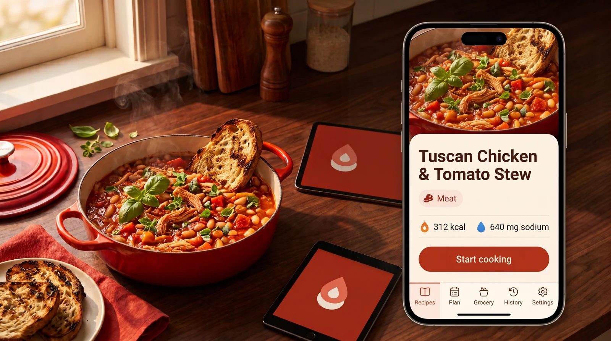</p>

<table>
<tr>
<td width="19%" align="center">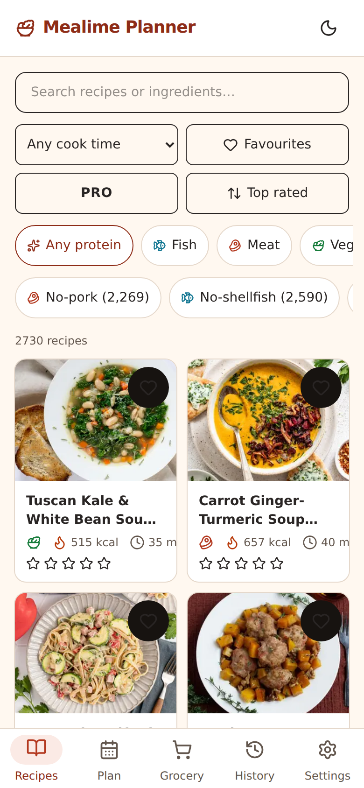<br /><sub><b>Recipes</b> — search, tinted filter chips and a photo-led food grid</sub></td>
<td width="19%" align="center">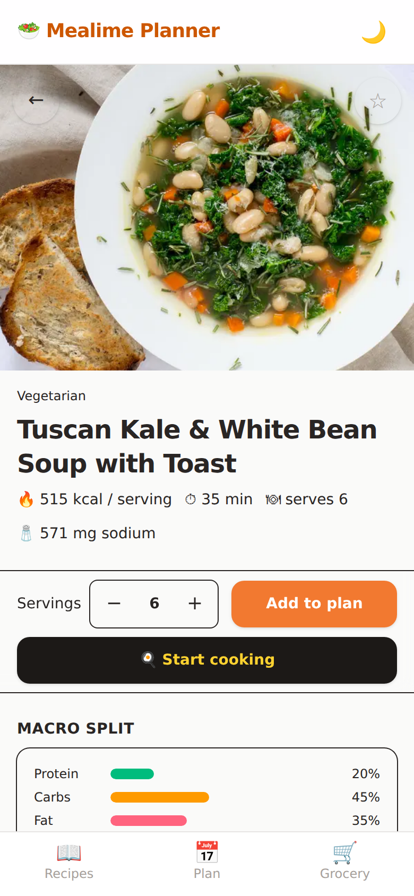<br /><sub><b>Recipe</b> — photo, type icon, filled <i>Start cooking</i> and the nutrition block</sub></td>
<td width="19%" align="center">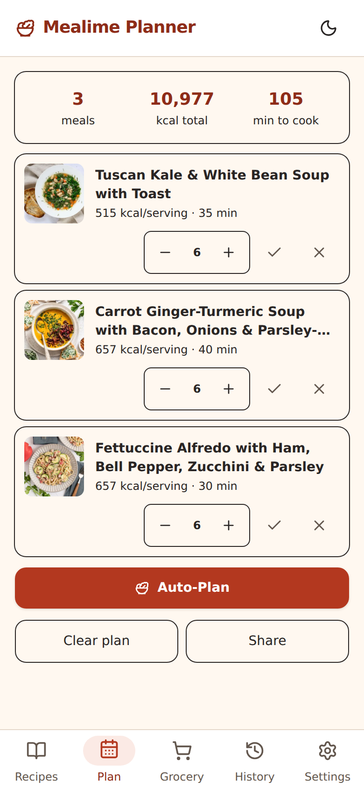<br /><sub><b>Plan</b> — meal rows with servings, live totals and the Auto-Plan route</sub></td>
<td width="19%" align="center">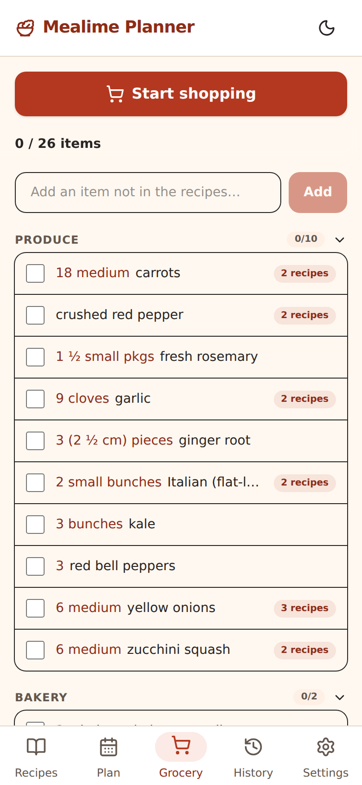<br /><sub><b>Grocery</b> — store sections, scaled quantities and provenance pills</sub></td>
<td width="19%" align="center">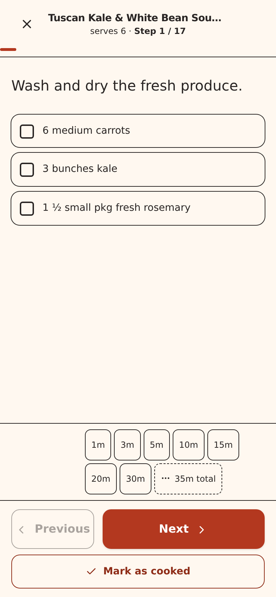<br /><sub><b>Cooking</b> — one step at a time on a 672px reading measure</sub></td>
</tr>
<tr>
<td width="19%" align="center">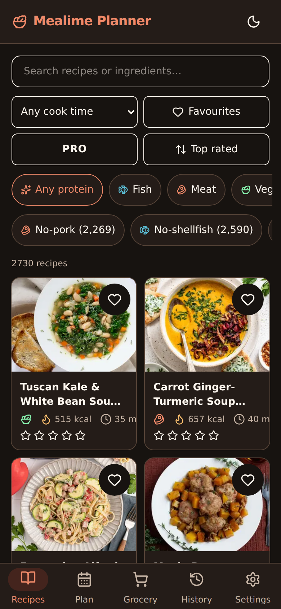<br /><sub>Espresso surfaces, soft food hues</sub></td>
<td width="19%" align="center">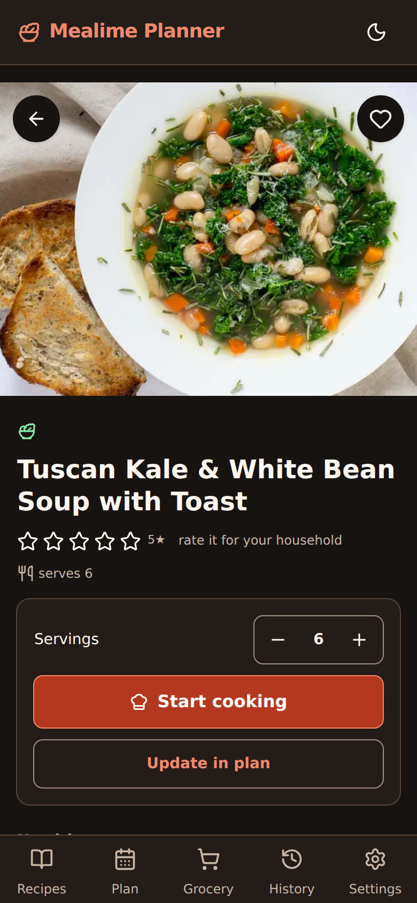<br /><sub>The same tomato action, now keyed for espresso</sub></td>
<td width="19%" align="center">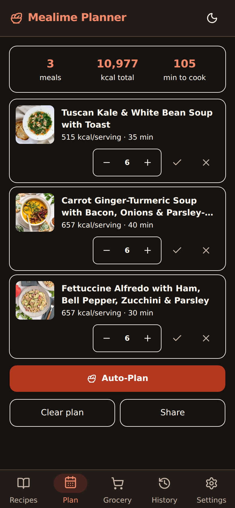<br /><sub>Warm-on-dark, no unstyled light surface</sub></td>
<td width="19%" align="center">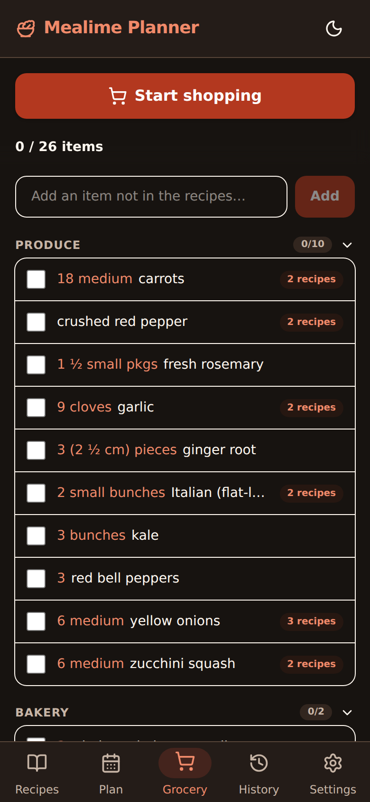<br /><sub>Quantities stay legible in both themes</sub></td>
<td width="19%" align="center">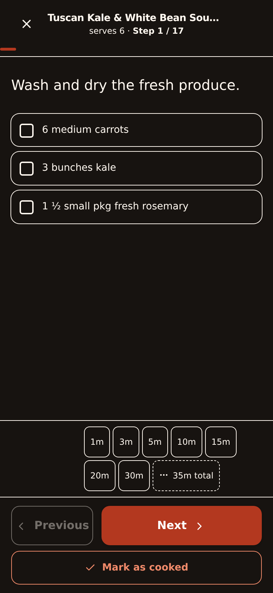<br /><sub>Hands-free step reader at the stove</sub></td>
</tr>
</table>

<p align="center"><sub>Every screenshot is captured from the running app
(<code>bun run dev</code>), on the seeded catalog, at 390&times;844 &mdash; light
and dark, from the same build.</sub></p>

A mobile-first single-page app for browsing a frozen recipe catalog (originally scraped from Mealime, whose name this project does not carry),
building a meal plan, and generating a grocery list from it.

Fully offline and fully self-contained: the repo ships the complete recipe
catalog — all 2,759 full recipe documents (`public/data/recipes/`, ~15 MB,
one JSON per variant id) plus the catalog snapshot — **and every recipe
image** (`public/img/recipes/`, one WebP per archived Mealime CDN image).
The app makes **no external requests at runtime**: recipe details are
fetched from the bundled local files, and all imagery (thumbnails,
presentation images, favourites) is served from the local archive via the
naming rule *remote-URL basename with the extension swapped to `.webp`*.
Recipes without an image (or whose local file is missing) fall back to a
neutral placeholder.

## Features

- **2,759 recipes, zero internet** — the whole catalog and every photo ship
  in the repo. Browse, search and cook with the network cable unplugged.
- **Auto-Plan** — a week of meals in one tap. It builds your plan around
  what you're already buying, so two recipes sharing a pack of cheese cost
  one package, not two. Same inputs, same plan — no randomness.
- **Grocery list that writes itself** — quantities merge across meals
  (`2 cloves` + `1 clove` → `3 cloves`), items sort into store aisles, and
  shared ingredients carry a "N recipes" badge.
- **Cooking mode** — one step at a time, big text, per-step timers that
  survive a reload. Built for flour-covered hands.
- **Cook together** — share a three-word room code (`amber-falcon-lantern`)
  and every plan change syncs live to everyone's phone.
- **Your history, yours** — what you cooked, browsable on its own tab.
  Private until you say otherwise.
- **Shopping mode** — a full-screen, big-button checklist for the store.
  Finished aisles collapse themselves.
- **Diet filters & dark mode** — vegetarian, vegan, no-pork, no-shellfish
  chips across search and Auto-Plan; a proper dark theme, not inverted
  colors. Everything works offline, on your own server, no account.

<details>
<summary>All the details</summary>

- **Recipes** — responsive card grid with search by name or ingredient,
  category / favourites / cook-time / PRO filters, and sorting by rating,
  popularity, latest, cook time or calories. Full-screen detail view with
  presentation image, macro split, cookware, ingredients and instructions,
  plus a servings stepper that scales quantities (per-serving nutrition
  stays fixed; only totals scale).
- **Diet filters** — chips for no-pork, no-shellfish, no-meat, vegetarian
  and vegan, applied across search, browse and Auto-Plan. The catalog
  ships no diet metadata, so this is a transparent keyword heuristic over
  each recipe's ingredient list: a fast suggestion lens, not a guarantee.
- **Auto-Plan** — a deterministic pack builder scores recipes by *marginal
  package cost* (how many extra supermarket packages each pick would force
  you to buy, counting a container as bought whole), weighted against
  vote-smoothed rating and variety, and skips pantry staples you already
  have. Default mode ADDS to your current plan; a meal-type selector
  (Dinner / Breakfast / Dessert / Any) scopes each run. Pick a pack size,
  optionally exclude categories or diets, confirm, undo if unhappy.
- **Plan** — add recipes with per-meal serving counts. A remembered
  default serving size (changeable in Settings) pre-fills every new
  recipe, generated plan and re-planned meal.
- **Grocery** — aggregates ingredient line items across the whole plan:
  parsed and scaled per meal, merged by singularized name
  (`carrot`/`carrots`), summed per normalized unit, bucketed into
  canonical grocery-store sections. Free-form **Extra items** render in
  their own group at the top.
- **Waste-aware quantities** — container-shaped amounts
  (`½ (142 g) pkg`, `1 small bunch`) are purchased units, merged with a
  ceiling; spoon/measure amounts stay linear and seasonings scale
  sub-linearly. Recipe text is never altered.
- **Cooking mode** — full-screen step-by-step view with per-step scaled
  ingredients, measured-amount chips, progress and keyboard/swipe
  navigation. Timer state survives reloads; finishing with one running
  asks first.
- **Cooking history** — per-recipe stats on its own History tab. Personal
  by default: shared with a room only if you opt in.
- **Live room sync** — one person creates the room, anyone opening
  `/plan?room=CODE` joins; plan, custom items, checkmarks and cleared
  ingredients propagate both ways. Codes are three words, rolled
  client-side, shareable in one tap; a household room re-joins on every
  launch. One-time `?p=` links still work offline.
- **Backup & restore** — export everything to a single JSON file; restore
  validates first, so a bad backup can never leave you half-imported.
- **Dark mode** — follows the OS on first load; header toggle overrides
  and persists.

</details>

Favourites are seeded from the data snapshot and can be toggled per recipe.

## Hosted instance

**https://flambette.app** runs the same app, deployed as two Cloudflare
Workers (ADR-0038): the SPA from static assets on `flambette.app`, and the
room relay as a Durable Object on `ws.flambette.app`. No setup, no server —
the household room works exactly as it does self-hosted, and rooms survive
after the last peer leaves until the expiry clocks fire.

## Run with Docker Compose (recommended)

`docker-compose.yml` starts two services: **web** (nginx serving the app,
port 8097 on the host) and **relay** (the WebSocket sync service). nginx
proxies `/ws` to the relay, so everything is served from one origin.

```bash
docker compose up -d --build
# open http://localhost:8097
```

Stop with `docker compose down`. The relay keeps room state in memory —
restarting it drops live rooms (plans/checklists live in each browser's
`localStorage` and are never lost). Any client back in afterwards simply
re-establishes the room: `join` creates a code the relay does not know
yet (ADR-0026).

## Run with the published images

Every release publishes both images to GitHub Container Registry, so you can
run the app without cloning or building anything:

```bash
docker compose pull
docker compose up -d
```

Tags follow the release version (`0.11.1`), plus `0.11` and `latest`. Note
that the `v` from the git tag (`v0.11.1`) is **stripped** in the registry —
pull `0.11.1`, not `v0.11.1`.

## Run with plain Docker

No volume is needed — the full offline catalog, images and app bundle are
baked into the image. Running without compose means no live-room sync
(no relay behind `/ws`); everything else works.

```bash
docker build -t flambette .
docker run -d -p 8080:80 flambette
# open http://localhost:8080
```

Build is multi-stage (`oven/bun:1-alpine` → `nginx:alpine`) with gzip, an SPA
fallback and cache headers (immutable 1y for `/assets/` and `/img/`, no-cache
for `index.html`).

## Behind Traefik

Expose **only the `web` service** — Traefik routes `Host` traffic to it and
nginx internally proxies `/ws` to the relay. Add these labels to the `web`
service in your compose file:

```yaml
services:
  web:
    image: ghcr.io/belphemur/flambette:latest
    networks: [traefik, internal]   # internal carries web→relay /ws traffic
    labels:
      - traefik.enable=true
      # Router: match your hostname, terminate TLS
      - traefik.http.routers.mealime.rule=Host(`mealime.example.com`)
      - traefik.http.routers.mealime.entrypoints=websecure
      - traefik.http.routers.mealime.tls.certresolver=le
      # Service: nginx listens on port 80 inside the container
      - traefik.http.services.mealime.loadbalancer.server.port=80
      # Do NOT expose the relay directly — /ws goes through nginx
      - traefik.docker.network=traefik

  relay:
    image: ghcr.io/belphemur/flambette-relay:latest
    networks: [internal]
    # no ports:, no traefik.enable — reachable only from web

networks:
  traefik:
    external: true   # the network your Traefik instance is attached to
  internal:
```

Use `build: .` / `build: ./server` instead of `image:` if you want to run
unreleased code from a checkout.

Replace `mealime.example.com` and `le` with your hostname and certificate
resolver. Serve over **HTTPS**: browsers only expose the native share
sheet (`navigator.share`) and the async clipboard API on secure origins,
so Android's share button appears — and copy-to-clipboard gets its
reliable path — once the app is behind TLS. Plain-HTTP LAN access still
works via the clipboard `execCommand` fallback.

## Development

```bash
bun install
bun run dev                      # dev server (proxies /ws to the relay)
bun server/relay.ts             # relay on :8081 (dev/e2e)
bun run build                    # type-check + production build into dist/
bun run preview                  # serve the production build locally
bun run test:unit                # unit specs for the pure libs
bunx playwright test             # e2e suite (starts the relay itself)
```

The relay is a zero-dependency Bun service (`server/`, Bun's native
WebSocket API, in-memory only — a room is created by whichever client
arrives first, deleted when its last peer leaves, and expires after 24h
with no keepalive and no activity, a 7-day idle backstop; ADR-0038
widened ADR-0026's clocks);
`server/README.md` documents the wire protocol.

## Cloudflare deployment (ADR-0038)

Two Workers, two configs: the root `wrangler.jsonc` serves `dist/` as an
assets-only worker on `flambette.app`; `server/wrangler.jsonc` runs the
room relay as a `Room` Durable Object on `ws.flambette.app`. Production
deploys fire from Cloudflare's Workers Builds on tag creation — there is
no CI deploy job and no deploy token in the repo.

```bash
bun run deploy:web              # wrangler deploy (web, needs bun run build first)
bun run deploy:relay            # wrangler deploy -c server/wrangler.jsonc
bun run dev:relay               # the DO relay locally on :8787
bun run test:worker             # DO specs in workerd (vitest-pool-workers)
bunx wrangler deploy --dry-run  # worker-side gate, run for BOTH configs
```

The web worker is assets-only — there is no `/ws` on `flambette.app` — so the
HOSTED build must bake the relay origin in:
`VITE_RELAY_WS_URL=wss://ws.flambette.app/ws bun run build && bun run deploy:web`
(ADR-0038 §5; a build-time value, so it belongs in the deploy command or the
dashboard's build env, never in the source). A plain `bun run build` keeps the
same-origin default for dev, e2e, LAN and Docker.

The client reaches the relay on its own origin by default (dev, e2e, LAN
and Docker all proxy `/ws`); set `VITE_RELAY_WS_URL` at build time to
point it at a relay living elsewhere — `ws://<host>`/`wss://<host>`,
e.g. the hosted relay or a relay on another machine.

## Stack

- Vue 3 (`<script setup>`) + Vite + TypeScript
- Tailwind CSS v4 (via `@tailwindcss/vite`), class-based dark mode via
  `useDark` from `@vueuse/core` (system preference by default, manual
  override persisted)
- Vue Router 4 for deep-linkable routes — five bottom tabs (`/`,
  `/plan`, `/grocery`, `/history`, `/settings`) plus `/shop`,
  `/recipe/:id`, `/cooking/:id`
- State via Pinia stores in `src/stores/`, persisted to
  localStorage under the `mealime-planner:v1:*` keys — the storage key keeps
  the historical name on purpose so existing installs keep their data
  (`mealime-planner:v1:favourites`, `mealime-planner:v1:plan`,
  `mealime-planner:v1:checked`); the live-room code is kept in
  sessionStorage (`mealime-planner:v1` scope, `room` store)
- Bun as the toolchain and runtime (`bun.lock`); Docker base images are
  `oven/bun:1-alpine` (build) and `nginx:alpine` (serve)
- No runtime dependencies besides Vue, Pinia, MiniSearch (search) and
  `@vueuse/core`

## Data provenance

- `public/data/recipes/{variant_id}.json` — the complete offline catalog:
  2,759 full recipe documents (ingredients, line items, scaled instructions,
  cookware, nutrition), one file per variant id in `feasible_variants`.
- `public/data/builder_data.json` — a snapshot of Mealime's recipe-builder
  payload (2,759 feasible recipe variants with metadata, macros, ratings,
  ingredient names and image references).
- `public/img/recipes/` — the offline image archive: one WebP per distinct
  Mealime CDN image (thumbnails at 400px, presentation images at 800px),
  named after the basename of the original remote URL. Resolved at runtime
  by `src/lib/images.ts`.
- `public/data/user_data.json` — reference-only snapshot of a user account
  (used to extract the canonical grocery-store section list and the seed
  favourites; the auth token in it was scrubbed before it entered git).
  Not fetched by the app.
